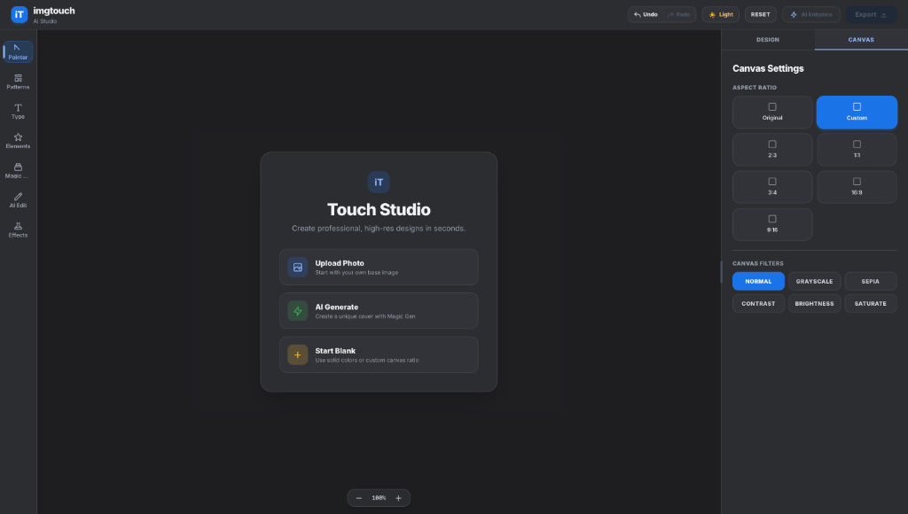

# ImgTouch - AI Creative Studio

<div align="center">
  
</div>

ImgTouch is a premium, smooth, and professional creative studio powered by AI. It offers state-of-the-art tools to generate, edit, and enhance images using Gemini.

## 🌟 Key Features

- **Magic Gen**: Create stunning images from text prompts with Gemini.
- **AI Edit**: Modify existing images using natural language prompts.
- **AI Super Resolution**: Enhance image clarity and details seamlessly.
- **Design Patterns & Presets**: 1-click layout templates for Quotes, YouTube Thumbnails, Social Stories, and Tech Banners.
- **Undo / Redo Engine**: Full state history tracking with `Cmd+Z` / `Ctrl+Z` & `Cmd+Shift+Z` / `Ctrl+Y` shortcuts.
- **Resizable Workspace & Zoom**: Drag-resizable property panel and floating canvas zoom controls (`30%` to `250%`).
- **Google Material Theme**: Crisp Light and Dark themes with clean color chips and smooth transitions.
- **Full Canvas Control**: Layer reordering (Front/Up/Down/Back), layer cloning, image flipping, text styling, and custom sticker support.

## 🛠️ Run Locally

**Prerequisites:** Node.js (v18+)

1. **Install dependencies:**
   ```bash
   npm install
   ```

2. **Set your Gemini API key** in `.env.local`:
   ```env
   GEMINI_API_KEY=your_gemini_api_key_here
   ```

3. **Start the development server:**
   ```bash
   npm run dev
   ```

## ⚡ Powered By
- **React 19**
- **Vite**
- **TailwindCSS**
- **Google Gemini 2.5 API**
